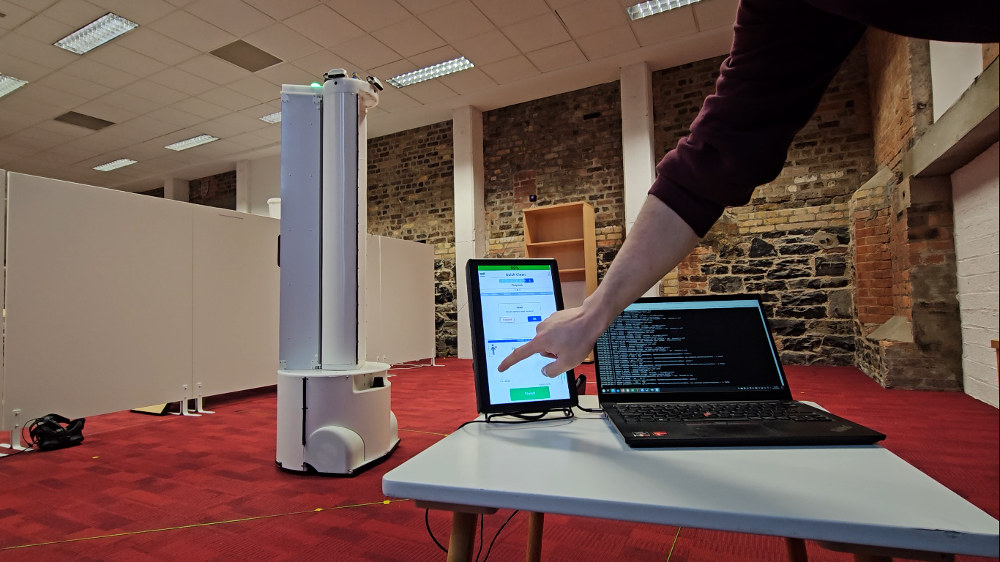

---
title:
- ROS Deployment
author:
- Cian Donovan
theme:
- Copenhagen
date:
- December 4, 2023
---

# Intelligent Hospital Automation

# Robotics Research Group Trinity College 

# Robotics Research Group Trinity College 

- Research group of mostly mechanical engineers
- Learned ROS through online tutorials
    - No docs on deployment or best practices

# Early software as refined as the hardware

# Early software as refined as the hardware

# Naive Beginner's Architecture

- ROS recommends Ubuntu - let's use Ubuntu Desktop
- How do we start our apps/nodes?
    - Autostart entry I guess?
    - This thing called .xinitrc people on Stackoverflow recommended?
- Obviously things don't go well when things crash...

# We've heard hype around this thing called Docker

- Solves dependency hell
- If it works on my machine it works on yours
    - effective dev/prod parity
- OS/App separation
- Basic autostart and restart functionality
- Some security

# Rootfull Docker Daemon

- Docker runs as a rootfull daemon
    - At the time at least, no rootless option
- A rogue container could mount the host filesystem
    - Even the audit system would only see the Docker user as performing those commands, not the real culprit who issued the requests 
- The Docker daemon itself runs as a systemd service
    - Containers are managed by itself
    - Trying to wrap `docker run` in a systemd service would only wrap an RPC call and not the process - not very useful!

# Transition to Podman

- API compatible (mostly) with Docker
- Can use Dockerfiles or its own BuildAh system
- No daemon!
- Rootless!
- Uses classic UNIX/POSIX fork-exec
    - spawns new children in a different namespace that are containerized

# Problems with Ubuntu...

- Weird WiFi kernel bugs causing uninterruptible sleeps...
- Packages not as stable as Debian
- Netplan/Snaps/etc...
- Depreciated preseed/kickstart support

## No worries! Containers are portable!

- Move to Debian almost hassle free!
- No changes needed to ROS whatsoever
- Debian doesn't even support ROS
    - With containers, doesn't matter!

# GitLab/GitHub pipelines

- Many hosted VCS offer CI/CD
    - Dockerfiles are standard
    - Produce OCI images
    - "Just Work TM" with podman

# Leveraging the power of systemd

- Scheduling integrated with rest of systemd bringup
- Easy monitoring with systemctl & journalctl
- Guaranteed cleanup with pidfd & cgroups
    - no dangling or orphaned processes

# udev rules

- Allow access to hardware without root
    - Use to change groups or add ACL with uaccess/systemd
- Symlink creation for static device naming
    - Match against USB PID/VID & USB Port
    - Uniquely identify device
    - Tag with systemd for "Userspace Driver"

# "Userspace Drivers"

- Event-triggered systemd/podman/ROS startup on device plugin
- Automatic cleanup and idle on plugout without polling

# "Userspace Drivers"

![[Unit]](img/systemd_unit.png)

# "Userspace Drivers"

![[Service]](img/systemd_service.png)

# "Userspace Drivers"

![[Install]](img/systemd_install.png)

# Who needs root? Not us

- Need access to hardware?
    - udev rule to change group or tag uaccess
- Realtime scheduling?
    - adjust /etc/security/limits.conf
- Set cpu_dma_latency?
    - more udev rules!
- Graphics?
    - Run Weston externally (ok not in a container)
    - bind-mount wayland socket, /dev/dri devices 
    - use systemd socket activation

# Managing all these configuration files

- Ansible/Jinja2
    - "roles" for each function to configure
        - Display, Audio, Networking, Firewall, Containers, Udev, etc.
- Defaults set in each role
- Machine specific manifest defines what containers/udev rules
- Developer machine a subset of a robot
    - Only configures container/udev

# Developer Setup

- Machine-specific manifest using Jinja2/Ansible
    - Specifies what debug variables, RMW, nodes, udev rules, etc.
    - Override defaults set in each role
        - default secure

# Developer Setup Desktop

# Developer Workflow

# Developer Workflow

# Developer Workflow

# Live Containerized Developer Environments

- Every dev has the same environment
- Source-code volume mount
    - Can still use host IDE, VCS, etc.
    - Code built and run in curated environment as production
- ROS Desktop Container
    - Full-fat install including custom messages and graphical tools
    - No need to install ROS on the host!

# Limitations...

- Doesn't address underlying OS
    - current system is at least agnostic about it
- Not bit-for-bit reproducible
    - Dockerfiles/BuildAh upstream sources change
    - Flatpak/Bubblewrap OCI?

# Limitations...

- Ansible not perfectly idempotent
    - no negative dependencies
    - configuration drift and cruft

# Limitations...

- Lack of coherency between container versions
    - Need to carefully coordinate and tag
    - Deploy and run together atomically
- Leaky /sys & /proc
    - Discrepancy between /sys & /dev (librealsense-sdk)

# Future work

- Move base OS to Yocto
    - Better reproducibility
    - Need to maintain flexibility of Ansible/Jinja2 templating
- Custom `podman auto-update` client
    - Apply update and rollback policies
    - Update even stopped containers
    - Telemetry?

# Thank you

- Questions?
